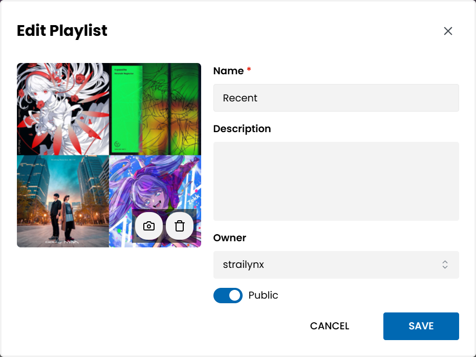

# Playlist Cover Stitcher

Playlist Cover Stitcher is a small desktop Python tool that creates one seamless 1000x1000 PNG playlist cover from four square-cropped album covers. Helpful when creating playlists in Navidrome or Apple Music, to keep the covers of playlists consistent across platforms rather than generated by app randomly — or no covers at all.




# Features

- Click a grid tile to choose an image.
- Drag one image file onto a tile to fill that tile.
- Drag multiple image files onto the window to randomly fill empty tiles.
- Right-click a tile to paste into it or delete only that tile.
- Move the mouse over a tile and press `Ctrl+V` to paste clipboard content.
- Drag from one filled tile to another filled tile to swap them.
- Click `Shuffle` to randomly rearrange the four loaded images.
- Centre-crop non-square images before resizing.


Example image from: Getty, Kobaryo, Srav3R, Zekk and t+pazolite

## Repository Layout

```text
playlist-cover-stitcher/
  .gitignore
  LICENSE
  README.md
  main.py
  pyproject.toml
  requirements.txt
  src/
    playlist_cover_stitcher/
      __init__.py
      __main__.py
      app.py
```

`main.py` is kept as a compatibility launcher, while the application source
lives under `src/playlist_cover_stitcher/`.

## Dependencies

- Python 3.10 or newer
- Pillow
- PySide6

`Pillow` is required for image loading, cropping, resizing, clipboard image
support, and PNG export. `PySide6` provides the Qt desktop controls and
built-in drag-and-drop support.

Install dependencies into the same Python environment used to run the app:

```powershell
python -m pip install -r requirements.txt
```

## Run

Run from the repository root:

```powershell
python main.py
```

For package-style execution, first install the project in editable mode:

```powershell
python -m pip install -e .
```

Then run the package module:

```powershell
python -m playlist_cover_stitcher
```

The editable install also provides the console script:

```powershell
playlist-cover-stitcher
```

## Checks

Generate sample input images and a stitched smoke-test PNG:

```powershell
python main.py --self-test
```

Check drag-and-drop availability:

```powershell
python main.py --check-dnd
```

Drag-and-drop is provided by Qt, so no extra drag-drop package is required.

Smoke-test output is written to `smoke_test_output/`, which is ignored by Git.

## Git Ignore

The `.gitignore` excludes Python caches, virtual environments, package build
outputs, coverage artefacts, editor folders, OS metadata, logs, and generated
tool output such as `smoke_test_output/`.

## Licence

This project is licensed under the GNU General Public License v3.0.

Copyright (C) 2026 strailico5327.

## Notes

This project was developed with assistance from OpenAI Codex. The code has been reviewed and tested before release.
